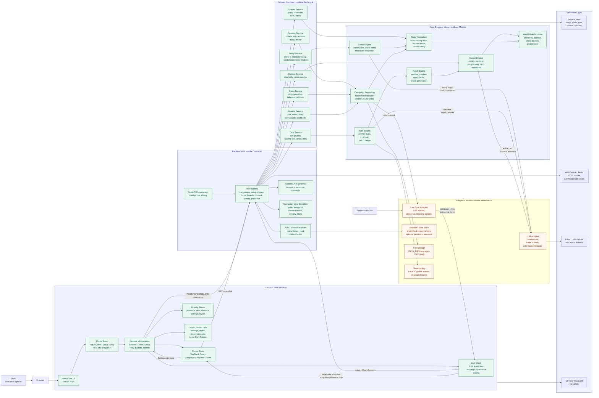

# Aelunor Ideal Architecture Overview

Stand: 2026-06-03

## Zielbild

Dieses Diagramm zeigt, wie Aelunor idealerweise aussehen sollte, wenn die aktuelle Architektur sauber stabilisiert ist: eine aktive UI, klare API-Contracts, explizite Service-Dependencies, getrennte Persistenz-, Live-Sync- und LLM-Adapterschichten sowie kleine Domain-Module fuer Setup, Claims, Turns, Canon, Boards und Sheets.

Das Ziel ist nicht maximale Abstraktion, sondern ein wartbarer MVP-Kernflow:

`Session -> Setup -> Claim -> Character Setup -> Play -> Turn -> Persist -> Live Sync -> Reload`.

## Diagramm

## Was daran besser ist

- Nur eine aktive UI: Die React/Vite-v1-UI ist der produktive Pfad; Legacy wird entfernt oder klar als Read-only-Fallback markiert.
- Keine versteckten Globals: Engines erhalten explizite Dependencies statt `configure(globals())`.
- Kleine Kernmodule: Persistenz, Normalisierung, Turn-Pipeline, Canon und LLM sind getrennt testbar.
- Klare State-Regel: Campaign JSON ist persistente Wahrheit; Presence/SSE bleibt Live-Signal, nicht State-Quelle.
- Sicherere Sessions: Stream-Tickets und Sessions sind kurzlebig oder bewusst gespeichert; Roh-Tokens liegen nicht breit in lokalen Komfortdaten.
- Einheitlicher LLM-Zugang: Ollama ist nur ein Adapter; Tests nutzen Fake-LLMs.
- Sauberer Live-Sync: Erst nach erfolgreichem Persist-Commit wird `campaign_sync` gesendet; Presence bleibt separat.
- Reviewbare Entwicklung: Neue Fachlogik landet in Services/Core-Modulen, Router und `main.py` bleiben duenn.

## Migrationspfad aus dem Ist-Zustand

1. Aktiven UI-Pfad konsolidieren: `/` -> `/v1` beibehalten und keine neue Arbeit in `app/static/` starten.
2. LLM-Adapter einfuehren: bestehende Ollama-Funktionen hinter einen kleinen Rollen-Client legen.
3. `state_engine.py` schrittweise teilen: zuerst Repository/Persistence, danach Setup- und Sheet-Views.
4. Runtime-Bruecken reduzieren: pro extrahiertem Modul eine Dependency-Dataclass und `runtime_symbols()` weiter verkleinern.
5. Save/Broadcast entkoppeln: Persistenz als Commit, Broadcast als nachgelagerter Live-Event mit Recovery-Fallback.
6. v1-UI-State vereinheitlichen: URL fuer offene Oberflaechen, Stores fuer abgeleitete Renderdaten.
