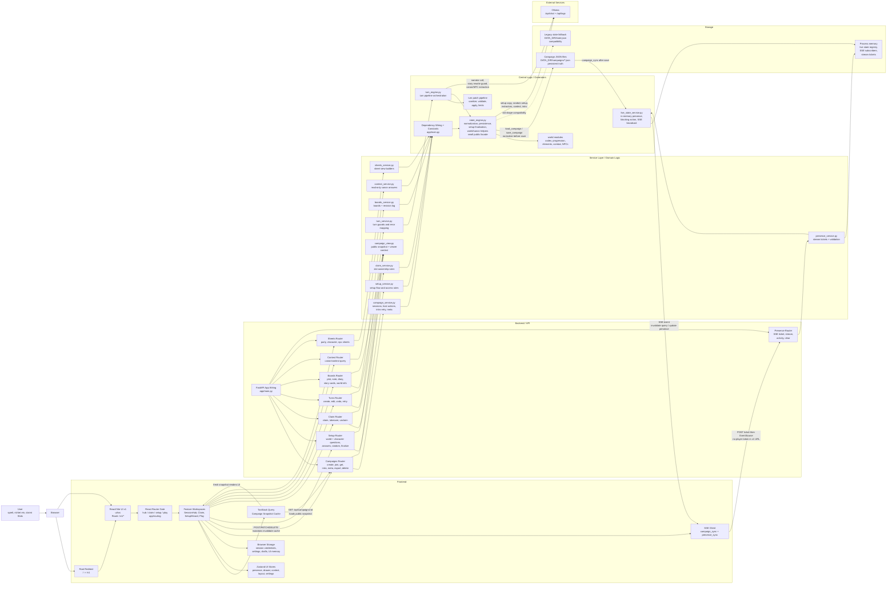

# Aelunor Webapp Architecture Overview

Stand: 2026-06-04

## Kurzfassung

Aelunor besteht aus einer FastAPI-App mit einer aktiven React/Vite-v1-UI unter `/v1`; `/` leitet auf `/v1` weiter. Die v1-UI nutzt React Router, TanStack Query fuer Campaign-Snapshots und Mutationen, Zustand fuer lokale UI-Stores sowie SSE fuer Live-Sync. Das Backend gruppiert HTTP-Endpunkte in duenne Router und delegiert Fachlogik an Services. Persistente Wahrheit ist JSON-Dateispeicherung unter `DATA_DIR/campaigns`; Live-Presence ist nur transient im Speicher. Ollama ist optionaler externer Generator fuer Setup-Texte, Story-Turns, Canon-Extractor, NPC-Extractor und Kontextantworten; Tests und Check-Scripts muessen ihn faken oder stubs/fallbacks nutzen.

## Erkannte Hauptbereiche

- Frontend v1: `ui/src/app`, `ui/src/features`, `ui/src/entities`, `ui/src/shared`
- Statische Assets: `app/static/`; keine aktive Legacy-UI
- API-Wiring: `app/main.py`
- Router: `app/routers/*.py`
- Services: `app/services/*.py`, `app/services/turn/*.py`, `app/services/world/*.py`, plus extrahierte Zielmodule in `items/`, `characters/`, `setup/`, `llm/`, `state/`
- API-Schemas und View-Serializer: `app/schemas/api.py`, `app/serializers/campaign_view.py`
- Persistenz: JSON-Campaign-Dateien in `DATA_DIR/campaigns`; lokale Browserdaten in `localStorage` und `sessionStorage`
- Extern: Ollama `/api/chat` und `/api/tags`

## Diagramm

## Haupt-Workflows

- Kampagne erstellen/joinen: `SessionHubWorkspace` -> `/api/campaigns` oder `/api/campaigns/join` -> `campaign_service` -> JSON-Campaign -> lokale Sessiondaten.
- Setup: `SetupWizardOverlay` -> setup API -> `setup_service` -> explicit dependencies -> `state_engine`/setup modules fuer AI-Copy, Random Answers, Finalisierung, World/Character Summary -> JSON save -> SSE.
- Claim: `ClaimWorkspace` -> claim API -> `claim_service` -> Claims im Campaign JSON -> SSE.
- Spielen: `Composer`/`CampaignWorkspace` -> turns API -> `turn_service` -> `turn_engine` -> Ollama Narrator/Extractors -> Patch-Pipeline -> State save -> SSE -> React Query reload.
- Live-Sync: Presence-Aktivitaeten gehen in `live_state_service`; persistente Campaign-Aenderungen senden `campaign_sync`; die v1-UI invalidiert danach den Campaign-Snapshot.
- Context und Sheets: UI fragt read-only Views ab; `context_service` prueft per State-Signature, dass Context Queries keinen State veraendern.
