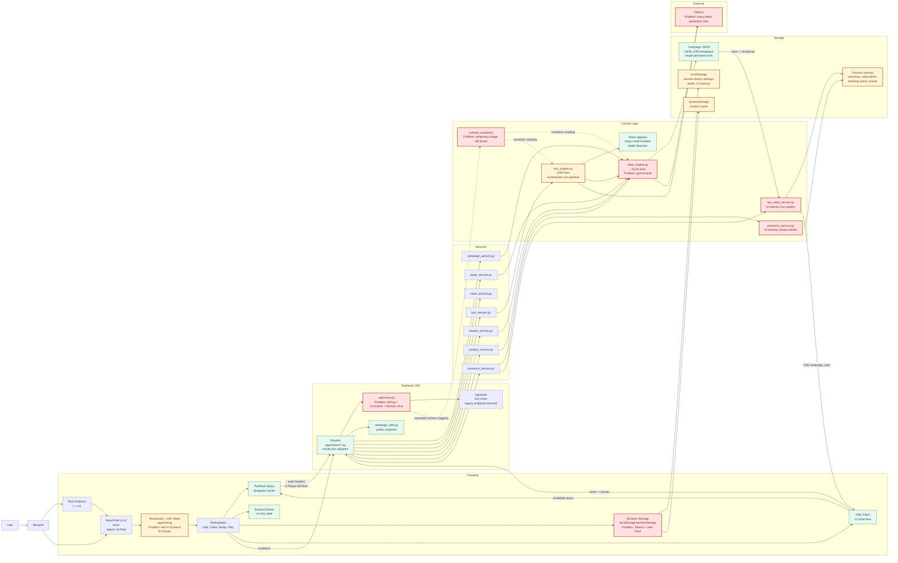

# Aelunor Architecture Problems Map

Stand: 2026-06-04

## Kurzfassung

Die Kernarchitektur ist spielbar und testbar, aber mehrere Bereiche sind schwer wartbar oder fragil. Die groessten Risiken liegen in der sehr grossen zentralen State-/Generatorlogik, dem noch breiten Turn-Wiring, lokaler Token-Speicherung und einigen Live-Sync-/Fehlerpfaden. Die aktive UI ist React/Vite-v1 unter `/v1`; `/` leitet dorthin weiter. Rot markierte Knoten sind problematische Stellen; gestrichelte rote Kanten zeigen Drift-, Kopplungs- oder Fragilitaetsrisiken.

## Diagramm

## Rote Markierungen

### Kritische Risiken

1. `ui/src/app/bootstrap/sessionStorage.ts`, `ui/src/features/session/sessionLibrary.ts`
   - Problem: Player-Tokens liegen dauerhaft in `localStorage` und zusaetzlich in einer Session-Library.
   - Warum problematisch: XSS oder fremde lokale Browserprofile koennen Tokens auslesen. Fuer ein lokales MVP ist das verstaendlich, aber es bleibt ein Auth-Risiko.
   - Bessere Loesung: Kurzlebige Session-Tickets, optional HttpOnly-Cookie fuer Webbetrieb, Library ohne Roh-Token oder mit explizitem Export/Import-Modell.

### Architekturprobleme

2. `app/services/state_engine.py`
   - Problem: Sehr grosses Modul mit Persistenz, Normalisierung, Setup, Kontext, Generatoren, Canon, World, Sheets und Kompatibilitaet in einem Laufzeitraum.
   - Warum problematisch: Aenderungen haben hohe Seiteneffekte; Review und Tests muessen viel Kontext halten.
   - Bessere Loesung: Weiter entlang bestehender Subsysteme extrahieren: Persistence, Setup Finalization, Context Index, Sheet Views, Generator Clients.

3. `app/services/state_engine.py:runtime_symbols()` und `app/services/turn_engine.py:configure`
   - Problem: Die breite Globals-Injektion ist im normalen State-Engine-Pfad entfernt, aber Turn-Wiring und Router-Factories brauchen noch eine begrenzte Runtime-Symbol-Bruecke.
   - Warum problematisch: Dependencies sind besser sichtbar als vorher, aber noch nicht vollstaendig explizit.
   - Bessere Loesung: Weitere explizite Dependency-Dataclasses fuer Turn-Engine-Cluster und Service-Factories einfuehren; `runtime_symbols()` nach jedem Slice verkleinern.

4. `app/main.py`
   - Problem: App-Wiring, Runtime-Konstanten, Prompt-/Schema-Erweiterung und Glue-Funktionen leben zusammen.
   - Warum problematisch: `main.py` ist kein reines Composition-Modul mehr und wird zum Engpass fuer Backend-Aenderungen.
   - Bessere Loesung: Konfiguration, LLM-Client und schema/prompt bootstrap in kleine Module auslagern; Router-Wiring in `main.py` belassen.

### Moegliche Bugs

5. `app/main.py`
   - Problem: `/api/state` ist entfernt und liefert `410 Gone`; falls alte lokale Clients existieren, brechen sie bewusst.
   - Warum problematisch: Alte Tools koennen noch den Legacy-Endpunkt erwarten.
   - Bessere Loesung: Nur aktuelle `/api/campaigns/...`-Contracts dokumentieren und alte Clients migrieren.

6. `ui/src/features/play/uiMemory.ts`
   - Problem: `writeState()` schreibt `localStorage` ohne `try/catch`.
   - Warum problematisch: Private mode, Quota oder Storage-Fehler koennen eine Komfortfunktion zur UI-Fehlerquelle machen.
   - Bessere Loesung: Wie bei `composerDraftStorage.ts` und `sessionLibrary.ts` Storage-Fehler still abfangen.

### Unklare Logik

7. `ui/src/app/routing/routes.ts`, `ui/src/features/play/CampaignWorkspace.tsx`
    - Problem: Scene, Boards, Drawer und Context sind im Querystring serialisiert, waehrend Drawer/Context zusaetzlich Zustand Stores nutzen.
    - Warum problematisch: Zwei UI-Wahrheiten muessen synchron bleiben; Back/Forward-Verhalten ist dadurch empfindlich.
    - Bessere Loesung: URL als alleinige Quelle fuer offene Oberflaechen definieren und Stores nur als abgeleitete Render-/Payload-Caches nutzen.

8. `app/services/live_state_service.py`
    - Problem: Presence, Blocking Actions und SSE-Subscriber sind nur pro Prozess im Speicher.
    - Warum problematisch: Reload, mehrere Worker oder Prozessneustart verlieren Live-State; Blocking Actions koennen zwischen Prozessen auseinanderlaufen.
    - Bessere Loesung: Fuer MVP dokumentieren, dass nur ein Prozess supported ist; spaeter Redis/Datei-gestuetzte Live-State-Abstraktion.

### Unnoetige Komplexitaet

9. `state_engine.py` plus `app/services/world/*.py`
    - Problem: World-Subsysteme sind teilweise extrahiert, aber einige Runtime-Pfade haengen noch an `runtime_symbols()` oder alten Modul-Globals.
    - Warum problematisch: Die Extraktion reduziert Dateigroesse, aber nicht vollstaendig Laufzeitkopplung.
    - Bessere Loesung: Module mit expliziten Inputs/Outputs stabilisieren und globale Rueckverdrahtung pro Subsystem abbauen.

10. `ui/src/shared/ui/SettingsDialog.tsx`, `ui/src/features/setup/SetupWizardOverlay.tsx`, `ui/src/features/play/CampaignWorkspace.tsx`
    - Problem: Mehrere UI-Dateien liegen bei 500+ Zeilen und mischen Koordination, Persistenz, Modals und Renderstruktur.
    - Warum problematisch: UI-Aenderungen sind schwer zu pruefen und laufen Gefahr, Nebenverhalten zu brechen.
    - Bessere Loesung: Nur bei konkreten Feature-Aenderungen kleine Hooks/Container extrahieren, nicht als Grossrefactor.

### Fehlende oder fragile Fehlerbehandlung

11. `app/services/state_engine.py`, `app/services/turn_engine.py`
    - Problem: Ollama wird fuer viele Rollen direkt genutzt: Narrator, JSON repair, Setup Copy, Random Answers, Extractors, Context.
    - Warum problematisch: Fehlerklassifikation existiert vor allem im Turn-Flow; Setup/Context koennen anders ausfallen oder unterschiedliche Fallbacks nutzen.
    - Bessere Loesung: Einheitlichen LLM-Client mit Timeouts, Rollen, Telemetrie, Fallback-Kontrakt und testbaren Fake-Adaptern einfuehren.

12. `app/services/presence_service.py`
    - Problem: Stream-Tickets liegen in einem Modul-globalen Dict.
    - Warum problematisch: Tickets verschwinden bei Neustart und funktionieren nicht ueber mehrere Backend-Prozesse.
    - Bessere Loesung: Fuer lokalen MVP okay, aber als Single-Process-Annahme dokumentieren; spaeter gemeinsamer TTL-Store.

13. `app/services/state_engine.py`
    - Problem: `save_campaign()` normalisiert, schreibt JSON und broadcastet SSE in einem Ablauf.
    - Warum problematisch: Wenn Broadcast fehlschlaegt, ist die Datei schon gespeichert; Clients koennen stale bleiben, obwohl Persistenz erfolgreich war.
    - Bessere Loesung: Persistenz-Erfolg und Broadcast-Erfolg getrennt behandeln, Broadcast-Fehler loggen und optional Recovery/Reload-Fallback anbieten.
