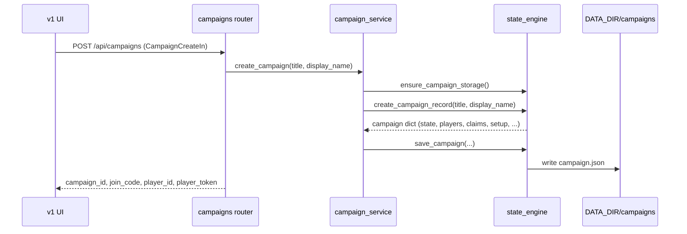
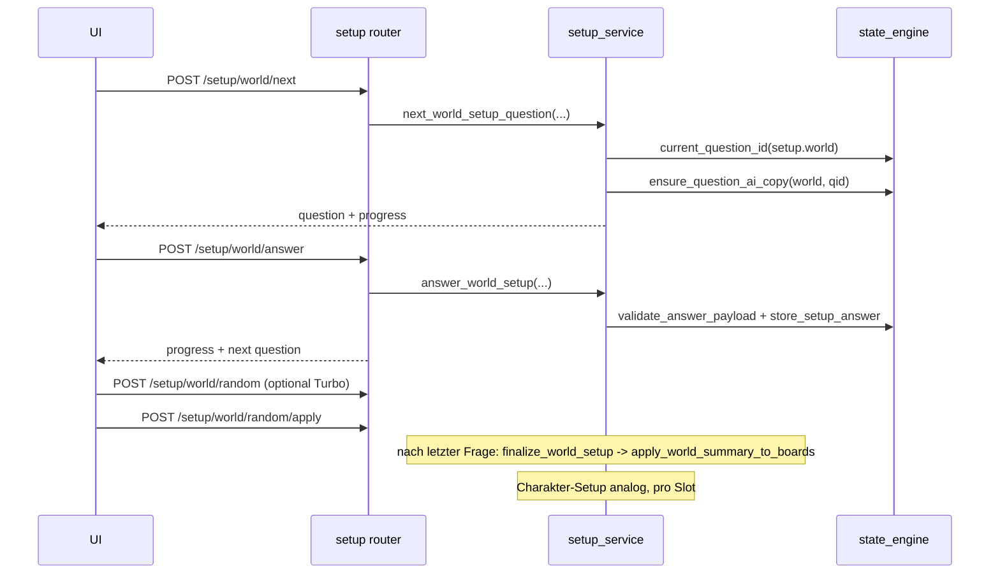
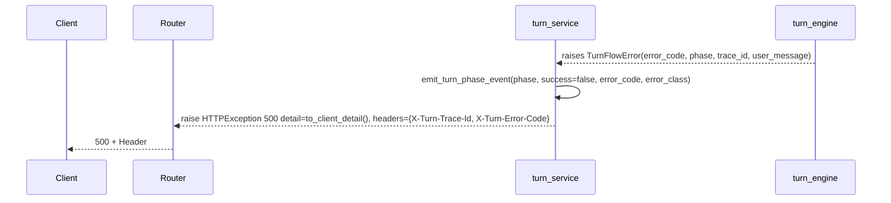

# AELUNOR – FLOW MAP

> Stand 2026-05-27. Pfade relativ zu `01_repo/aelunor-core/`.

Diese Datei beschreibt die wichtigsten Kontroll-/Daten-Flüsse von Aelunor und legt offen, an welchen Stellen Verträge zwischen Modulen anliegen.

---

## 1. Application Bootstrap

```mermaid
flowchart TD
  A[Python imports app.main] --> B[main.py loads constants, schemas, prompts.json, setup_catalog.json]
  B --> C[turn_engine.configure(globals)) #1 - frueh fuer Setup Finalize]
  C --> D[state_engine.configure(globals))]
  D --> D1[world.npc.configure]
  D --> D2[world.progression.configure]
  D --> D3[world.codex.configure]
  D --> E[Re-export state_engine.EXPORTED_SYMBOLS in app.main globals]
  E --> F[turn_engine.configure(globals)) #2 - vollstaendiger Symbol-Set]
  F --> G[FastAPI app + Static Mounts + ensure_campaign_storage()]
  G --> H[Router include_router(...)
    campaigns, presence, sheets, setup, claim, turns, context, boards]
```

**Vertrag:** Nach Import von `app.main` müssen folgende Globals in `state_engine`, `turn_engine`, `world.codex`, `world.progression`, `world.npc` sichtbar sein — das wird durch `tests/unit/test_main_state_engine_config.py` gesichert (6 Tests).

**Wichtige Konstanten in `app/main.py`** (Auswahl, vollständige Liste in `EXPORTED_SYMBOLS` und Konstanten-Block):

- `LEGACY_CHARACTERS`, `ACTION_TYPES`, `PHASES`, `SLOT_PREFIX`, `MAX_PLAYERS`, `MAX_TURN_MODEL_ATTEMPTS`, `CONTINUE_STORY_MARKER`.
- `CAMPAIGN_LENGTHS`, `TARGET_TURNS_DEFAULTS`, `PACING_PROFILE_DEFAULTS`, `TIMING_DEFAULTS`, `TIMING_EMA_ALPHA`, `AI_LATENCY_CLAMP`, `PLAYER_LATENCY_CLAMP`.
- Story-/Combat-/Manifestation-Trigger-Listen (`COMBAT_NARRATIVE_HINTS`, `STORY_ACTION_CUES`, `MANIFESTATION_*`, …).
- Element-Konstanten: `ELEMENT_TOTAL_COUNT=12`, `ELEMENT_CORE_NAMES`, `ELEMENT_RELATIONS`, `ELEMENT_RELATION_SCORE`, `ELEMENT_CLASS_PATH_RANKS`.
- Codex-Konstanten: `CODEX_KIND_RACE`, `CODEX_KIND_BEAST`, `CODEX_KNOWLEDGE_LEVEL_MIN/MAX`, `RACE_/BEAST_CODEX_BLOCK_ORDER`, `RACE_/BEAST_BLOCKS_BY_LEVEL`.
- Patch-Schemas (LLM): `RESPONSE_SCHEMA` (durch `extend_turn_patch_schema` dynamisch verbreitert), `CANON_EXTRACTOR_SCHEMA`, `PROGRESSION_EXTRACTOR_SCHEMA`, `NPC_EXTRACTOR_SCHEMA`, `STORY_REWRITE_SCHEMA`, `CHARACTER_ATTRIBUTE_SCHEMA`.
- Canon-Gate: `CANON_GATE_DOMAINS_SUPPORTED = ("progression", "items", "location", "faction", "injury", "spellschool")`, **aktiv: `CANON_GATE_ACTIVE_DOMAINS = {"progression"}`**.
- Error-Codes: `ERROR_CODE_*` (NARRATOR_RESPONSE, JSON_REPAIR, SCHEMA_VALIDATION, PATCH_SANITIZE, PATCH_APPLY, EXTRACTOR, NORMALIZE, PERSISTENCE, SSE_BROADCAST, TURN_INTERNAL) + `TURN_ERROR_USER_MESSAGES`.

---

## 2. Kampagnen-Anlage und Setup



**Setup-Phase (Welt + Charakter)**, vereinfacht:



**Phasen** (`PHASES = ("lobby", "world_setup", "character_setup_open", "ready_to_start", "active")`).

---

## 3. Turn-Pipeline (Story-Turn) — Hauptfluss

```mermaid
flowchart TD
  HTTP[POST /api/campaigns/{cid}/turns] --> TS[turn_service.create_turn]
  TS --> Auth[authenticate_player, slot exists, phase active, intro present, require_claim]
  Auth --> BLK[start_blocking_action submit_turn]
  BLK --> TE[turn_engine.create_turn_record]
  TE --> PREP[prepare_turn_working_state -> state_before, working_state, pacing, milestone]
  PREP --> AC[infer_combat_context + build_combat_scaling_context]
  AC --> AT[build_turn_attribute_context]
  AT --> CTX[build_context_packet]
  CTX --> PR[build_turn_user_prompt + build_turn_system_prompt]
  PR --> CAN{action_type == canon?}
  CAN -- ja --> CXP[call_canon_extractor source=player]
  CXP --> CSAN[sanitize_patch -> limits -> validate -> apply_patch]
  CSAN --> POST
  CAN -- nein --> LLM[Narrator Loop: call_ollama_json up to MAX_TURN_MODEL_ATTEMPTS]
  LLM --> GUARD{Format/Repetition/Inactive/Quality OK?}
  GUARD -- nein --> LLM
  GUARD -- ja --> SLG[rewrite_story_length_guard]
  SLG --> SAN1[sanitize_patch (narrator)]
  SAN1 --> BIAS[apply_attribute_bias_to_patch + apply_skill_cost_deltas_to_patch + apply_combat_scaling_to_patch]
  BIAS --> LIM1[enforce_non_milestone + progression_set limits]
  LIM1 --> VAL1[validate_patch]
  VAL1 --> APP1[apply_patch (narrator)]
  APP1 --> EXT[For source in player, narrator: call_canon_extractor -> sanitize -> limits -> validate -> apply]
  EXT --> POST[update_turn_timing_ema, compute_turn_budget_estimates, milestone_state_for_turn]
  POST --> MERGE[merge_patch_payloads(narrator, extractor) -> patch]
  MERGE --> CG[run_canon_gate (active: progression)]
  CG --> PROG[apply_progression_events + apply_skill_events]
  PROG --> NPC[call_npc_extractor -> apply_npc_upserts]
  NPC --> CDX[collect_codex_triggers -> apply_codex_triggers]
  CDX --> SKR[build_skill_system_requests]
  SKR --> REC[build_turn_record_payload]
  REC --> CMP[append turn, remember_recent_story, rebuild_memory_summary]
  CMP --> SAVE[save_campaign]
  SAVE --> RESP[return turn_id, trace_id, campaign view]
```

**Fehlerbehandlung in `turn_service.create_turn`**: alle `TurnFlowError` werden in `HTTPException 500` mit Headern `X-Turn-Trace-Id`, `X-Turn-Error-Code` umgewandelt. Andere Exceptions werden via `classify_turn_exception` klassifiziert.

**Phasen-Events** (`emit_turn_phase_event`, geloggt in JSON in `LOGGER "isekai.turns"`):

- `input_accepted`
- `narrator_call_started`, `narrator_call_finished`
- `patch_sanitize`, `schema_validation`, `patch_apply`
- `extractor_patch_generation`, `extractor_patch_apply`
- `npc_extractor`
- jeweils mit `success: bool`, `error_code`, `error_class`, `stage`, `attempt`

---

## 4. Patch-Lifecycle (detailliert)

```mermaid
flowchart LR
  In[LLM raw JSON] --> NMP[normalize_model_output_payload]
  NMP --> NS[normalize_patch_semantics (scene_set -> scene_id)]
  NS --> SAN[sanitize_patch]
  SAN --> LIM[enforce_*_limits]
  LIM --> VAL[validate_patch]
  VAL --> APL[apply_patch]
  APL --> POST[run_canon_gate, apply_progression_events]
```

**`apply_patch`** in `turn_engine.py` ruft pro Domain einen `turn/patch_apply_*`-Helper auf, in fester Reihenfolge:

1. `items` (`items_new` ins state["items"]).
2. `plotpoints` (add + update mit Normalizer).
3. `map` (Nodes + Edges).
4. `time` (`time_advance`).
5. **pro Character** (Slot vorhanden in `state["characters"]`):
   - `ensure_progression_shape`, `ensure_character_progression_core`.
   - `bio` (Name, Pronoun, etc.).
   - `resources_set/delta` + `attributes_set/delta` (clamp, world settings, RESOURCE_KEYS, ATTRIBUTE_KEYS).
   - `skills_set/delta` (dynamic skills, XP, level, cost, element).
   - `conditions_add/remove` + Effects.
   - `inventory_add/remove`, `equipment_set` (mit Slot-Mapping).
   - `abilities` + `potential` (Legacy-Shadow optional).
   - `progression_set/_update` (XP, level, class-XP, manifestation-claim-keys).
   - `journal_add` (include_factions=False).
   - `class_set/_update` (kompatibel mit `default_class_current`, ggf. `ensure_class_rank_core_skills`).
   - Faction Updates (include_journal=False) — bewusster zweistufiger Aufruf.
   - `injuries_add/_update/_heal`, `scars_add`, `appearance_flags_add`.
   - **Late Normalization**: `resolve_injury_healing`, `rebuild_character_derived`, `reconcile_canonical_resources`, `strip_legacy_shadow_fields`, `write_legacy_shadow_fields`, `sync_scars_into_appearance`.
6. `meta` (Phase).
7. `events_add` (mit `normalize_event_entry`).

---

## 5. Canon-Gate (Domain-Filter)

`run_canon_gate(campaign, state_before, state_after, patch, actor, action_type, player_text, story_text, trace_ctx)`:

- Liest `CANON_GATE_ACTIVE_DOMAINS` (aktuell nur `progression`).
- Prüft Patch-Felder gegen Claim-Cues (`PROGRESSION_CLAIM_CUES`) und Confidence-Threshold (`PROGRESSION_EXTRACTOR_CONFIDENCE_THRESHOLDS`).
- Kann unsichere Progression-Patches entschärfen (z. B. Skill-Manifestationen ohne hinreichende Evidenz).
- Liefert `{"patch", "state", "meta"}` zurück.

Andere geplante Domains (`items`, `location`, `faction`, `injury`, `spellschool`) sind im Schema vorhanden, aber **nicht aktiv geprüft**.

---

## 6. NPC- und Codex-Trigger nach jedem Turn

```mermaid
flowchart TD
  STO[gm_text + player_text] --> NEX[call_npc_extractor]
  NEX --> NUP[apply_npc_upserts] --> NPC[NPC-Codex state["world"]["npcs"]]
  STO --> CDT[collect_codex_triggers]
  CDT --> CTP[apply_codex_triggers] --> WCDX[world codex (races, beasts, npcs)]
```

`normalize_npc_codex_state(campaign)` läuft am Ende des Turns als Konsistenz-Pass.

---

## 7. Datenstrukturen (Public Contracts)

Diese Shapes sind effektiv Public Contracts; Tests in `test_state_engine.py` und `test_turn_engine.py` sichern sie an vielen Stellen.

### 7.1 Campaign-JSON (`DATA_DIR/campaigns/<campaign_id>.json`)

Top-Level (vereinfacht):

```json
{
  "campaign_meta": {
    "campaign_id": "...",
    "title": "...",
    "status": "...",
    "created_at": "...",
    "join_code": "..."
  },
  "players": {
    "<player_id>": {
      "display_name": "...",
      "player_token_hash": "...",
      "joined_at": "...",
      "last_seen_at": "..."
    }
  },
  "claims": { "slot_1": "<player_id|null>", ... },
  "host_player_id": "...",
  "state": { "meta": {...}, "characters": {...}, "items": {...}, "scenes": {...}, "map": {...}, "world": {...}, "events": [...], "memory_summary": "...", "recent_story": [...] },
  "setup": { "world": {...}, "characters": { "slot_1": {...}, ... } },
  "boards": { "plot_essentials": {...}, "authors_note": "...", "player_diaries": {...}, "story_cards": {...}, "world_info": {...} },
  "turns": [ TurnRecord, ... ],
  "intro_state": { "status": "...", "last_error": "...", "last_attempt_at": "...", "generated_turn_id": "..." }
}
```

### 7.2 Patch-Shape (`blank_patch()`)

```json
{
  "meta": {},
  "characters": { "<slot_id>": CharPatch, ... },
  "items_new": { "<item_id>": ItemDef, ... },
  "plotpoints_add": [...],
  "plotpoints_update": [...],
  "map_add_nodes": [...],
  "map_add_edges": [...],
  "events_add": ["string", ...]
}
```

`CharPatch` (per `merge_character_patch_update`) kennt folgende Schlüssel:

- Dict-Set-Felder: `bio_set`, `resources_set`, `resources_delta`, `attributes_set`, `attributes_delta`, `skills_set`, `skills_delta`, `equip_set`, `equipment_set`, `inventory_set`, `progression_set`, `class_set`, `class_update`, `journal_add`.
- List-Felder: `conditions_add`, `conditions_remove`, `inventory_add`, `inventory_remove`, `abilities_add`, `abilities_update`, `potential_add`, `factions_add`, `factions_update`, `injuries_add`, `injuries_update`, `injuries_heal`, `scars_add`, `appearance_flags_add`, `effects_add`, `effects_remove`, `progression_events`.
- Sonstige Direktfelder: `scene_id`, `scene_set` (wird auf `scene_id` normalisiert).

### 7.3 Turn-Record (`build_turn_record_payload`)

```json
{
  "turn_id": "turn_xxxx",
  "turn_number": <int>,
  "status": "active|undone|superseded",
  "actor": "slot_1",
  "player_id": "...",
  "action_type": "do|say|story|canon",
  "input_text_raw": "...",
  "input_text_display": "...",
  "gm_text_raw": "...",
  "gm_text_display": "...",
  "requests": [...],
  "patch": Patch,
  "narrator_patch": Patch,
  "extractor_patch": Patch,
  "source_mode": "do|say|story|canon",
  "canon_applied": false,
  "attribute_profile": {...},
  "combat_resolution": {...},
  "resource_deltas_applied": {...},
  "progression_events": [...],
  "canon_gate": {...},
  "npc_updates": [...],
  "codex_updates": [...],
  "combat_meta": {...},
  "state_before": State,
  "state_after": State,
  "retry_of_turn_id": null,
  "edited_at": null,
  "created_at": "...",
  "updated_at": "...",
  "edit_history": [],
  "prompt_payload": {"system": "...", "user": "...", "context": {...}, "pacing": {...}, "attribute_profile": {...}, "attribute_bias": {...}, "combat_context": {...}, "combat_scaling": {...}}
}
```

**Wichtig:** `state_before` ist eine Original-Referenz (nicht deep-copied), `state_after` ist eine Kopie. Das ist Absicht für Speicherersparnis, aber relevant für Code, das `state_before` mutiert (es darf nicht!).

### 7.4 Live-State (in-memory, nicht persistiert)

```json
{
  "activities": { "<player_id>": { "kind": "...", "until_ts": ..., "slot_id": "...", ... } },
  "blocking_action": { "player_id": "...", "kind": "submit_turn", "slot_id": "slot_1", "started_at": "...", "until_ts": ..., "version": ... },
  "version": <int>,
  "subscribers": [<queue.Queue>, ...]
}
```

TTLs: `typing_turn=5s`, `editing_turn=6s`, `claiming_slot=6s`, `building_character/world=8s`, `reviewing_choices=6s`. Blocking-Action-TTL: `120s`.

---

## 8. Error- und Trace-Flow



`TURN_ERROR_USER_MESSAGES` mappt Error-Codes auf deutsche Klartextmeldungen.

---

## 9. UI-Datenfluss (überblicksweise)

- React/Vite v1 ist Single-Page-App unter `/v1`.
- Auth-Header: `X-Player-Id`, `X-Player-Token` (gehasht serverseitig).
- React Query holt Campaign-Snapshot regelmäßig + invalidiert bei SSE-`campaign_sync`.
- Composer schreibt Draft lokal (`composerDraftStorage.ts`) — keine Server-Sync.
- SSE-Client (`sseClient.ts`) abonniert `/api/campaigns/{cid}/presence/stream`.
- `AppRoot` + `RouteGate` führen anhand Campaign-Phase und Claim-Status zu Hub/Setup/Claim/Play.

---

## 10. Bekannte Übergabepunkte mit Risiko

| Übergabepunkt | Risiko |
| --- | --- |
| `state_engine.configure(globals())` / re-export | Wenn `app.main` Symbol fehlt, brechen World-Module silent. Tests in `test_main_state_engine_config` schützen. |
| `merge_patch_payloads(narrator, extractor)` | Reihenfolge entscheidet, welcher Patch "gewinnt"; aktuell Extractor überschreibt Narrator-Sub-Felder, weil später kommt. |
| `apply_patch` Character-Subdomain-Reihenfolge | Late Normalization am Ende ist invariant (reconcile, derived, scars→appearance). |
| `run_canon_gate` | Nur `progression` aktiv; andere Patches gehen ungefiltert durch. |
| `save_campaign` | Kein Locking; konkurrierende Writes können State zerstören. |
| `live_state_service` | In-Memory; nach Restart sind Blocking Actions weg. Tests prüfen Lifecycle, nicht Restart. |
| `intro_state` | Wenn `status="failed"`, ist Turn-Erzeugung blockiert; UI muss Retry triggern. |

---

## 11. Unsicherheiten in dieser Map

- Canon-Gate-Detail-Logik wurde anhand `CANON_GATE_*`-Konstanten und Referenzen abgeleitet, nicht in jeder einzelnen Klammer verifiziert.
- `apply_patch` interne Reihenfolge wurde aus `turn_engine.apply_patch` Zeile 568–704 abgeleitet. Bei Änderungen dort muss dieser Flow nachgezogen werden.
- UI-Daten-Flüsse sind nur grob skizziert; keine Detail-Analyse der React-Stores.
